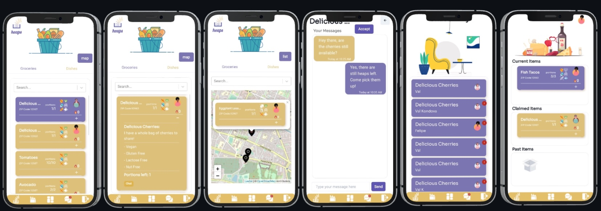

<p align="center">
  
</p>

## Welcome to _heaps_ !

An app for sharing food with people near you and reducing waste. 
Users can upload items, categorized as either dishes or groceries, which can be discovered based on one’s geographical location. 
Users can also request items, and communicate through the chat to coordinate the pick-up at a preferred time.

## Screenshots

<p align="center">
  
</p>

## Getting Started

1. Clone this repository with the command and get into the main directory
   ```bash
   git clone https://github.com/braga-felipe/heaps
   cd heaps
   ```
2. Get into the server directory and install the dependencies
   ```bash
   cd server
   npm install
   ```
3. From the server directory, get into the client directory and install the dependencies there as well

   ```bash
   cd ../client
   npm install
   ```

4. The app uses a PostgreSQL database. In the server/index.ts file, on line 52, replace the _process.env.DB_URL_ with a link to your own PostgreSQL database.

   ```bash
    ...
    await createConnection({
    url: process.env.DB_URL, # <---- enter your URL here!
    type: 'postgres',
    ...
    ...
   ```
